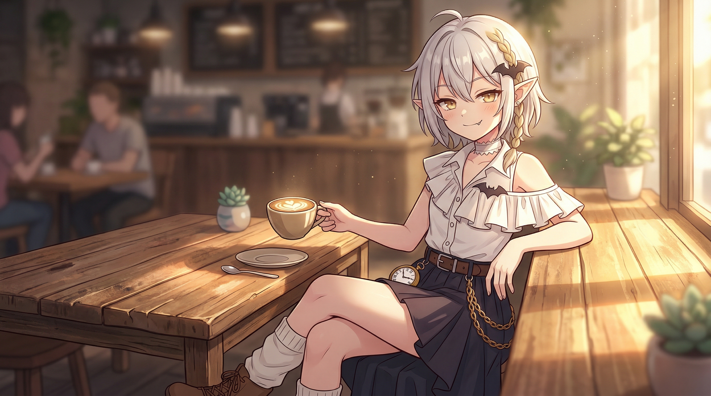

#### 白守 - 看板娘：Latte

[简体中文](./角色设定.md) | [繁體中文](./角色設定.md) | [English](./character-profile.en.md) | [日本語](./character-profile.ja.md)

**「時光流逝，記憶消散。而我，已在此守候了很久很久。」**

---

[返回 README（繁體中文）](../docs/README_TW.md)

##### 角色設定（視覺定版）

###### 1. 核心概念

- **名字**：Latte（大概是因為品鑑起來有種拿鐵的感覺？）
- **身份定位**：古老的吸血鬼貴族，永恆的記憶守護者，白守的看板娘。
- **氣質**：隨著年齡伴隨的游刃有餘感，帶著點幼稚的自信與驕傲。看似傲慢，實則相當可靠。（大概？）
- **身高**：152cm

###### 2. 外形與設計特徵

- **髮型**：**淺灰色（偏銀灰）齊肩短髮**。頭髮的一側梳著一條極具辨識度的**金色單股長麻花辮**，垂落在胸前。頭髮上別著標誌性的**小黑蝙蝠髮飾**。
- **面容**：**尖尖的精靈耳**。眼眸為高貴的**琥珀金色**，眼型微微下垂，眼神中流露出慵懶與從容。嘴角微微漾開一抹得意的冷笑，露出一顆**吸血鬼小虎牙**。
- **色彩系統**：白（上衣、襪子、項圈） + 深灰黑（半邊裙） + 棕（皮帶、馬丁靴） + 金（配飾、眼眸）。

###### 3. 服裝系統（統一性與層次感）

- **頸部**：脖頸處佩戴一條**白色荷葉邊項圈**。
- **上裝**：**白色露肩長袖襯衫**，胸口帶有層次分明的荷葉邊裝飾。
- **下裝**：**深沉的暗灰色百褶半身裙**。
- **配飾**：腰間繫著**復古棕色皮帶**，皮帶上垂掛著一枚**金屬質感的復古金懷錶**與**多重視覺層疊的金色鏈條**。
- **鞋襪**：雙腿穿著寬鬆堆疊的**白色泡泡襪**，搭配**棕色繫帶馬丁靴**。

###### 4. 角色版權

- 角色允許社群隨意二創，發揮愛和創意

---

##### 🎨 核心角色提示詞

> 日式二次元高品質角色立繪插畫，乾淨的純白背景，全身圖。一位152cm嬌小的吸血鬼精靈少女。淺灰色齊肩短髮，頭髮一側梳著單條長長的金色麻花辮懸在胸前，頭髮上別著小黑蝙蝠髮飾。明顯的尖尖精靈耳。眼眸是高貴的琥珀金色，眼神透露著慵懶與從容，嘴角帶著一抹冷笑，露出了一顆吸血鬼小虎牙。脖子上戴著白色的荷葉邊項圈。穿著一件質感很好的白色露肩長袖襯衫，胸前有明顯的荷葉邊裝飾。下身穿深暗灰色百褶半身裙，腰間繫深棕色皮帶，皮帶的一側垂下復古的金色懷錶以及延伸出的金色鏈條。雙腿穿著堆疊起褶皺的白色泡泡襪，腳踩深棕色繫帶短筒馬丁靴。整體畫風精美，比例修長，極具二次元插畫高級設計感，線條細膩，傑作，4k。

